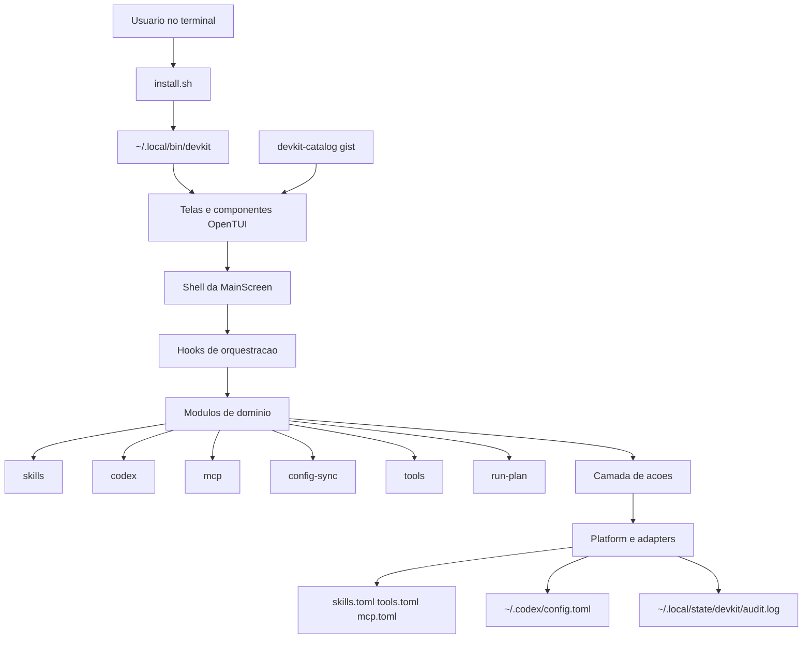
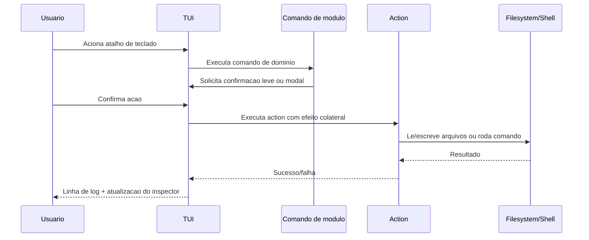

# Explicacao: visao geral de arquitetura

`devkit` usa uma arquitetura vertical-slice pragmatica para manter comportamento facil de localizar e manter.

## Arquitetura em alto nivel

## Por que esta estrutura

A arquitetura separa **o que o usuario faz** (slices de dominio) de **como os efeitos colaterais acontecem** (actions/platform):

- `src/modules/*` agrupa comportamento de dominio orientado ao usuario.
- `src/actions/*` executa comandos e operacoes de filesystem.
- `src/adapters/*` isola shell e I/O de arquivos.
- `src/screens/*` trata renderizacao e orquestracao de interacao.

Isso reduz risco de reintroduzir um unico arquivo "god" para todo o comportamento.

## Modelo de execucao em runtime

## Fronteiras principais

- Componentes de UI nao devem embutir regra de negocio de dominio.
- Modulos de dominio devem evitar imports cruzados entre dominios.
- Contratos de catalogo sao validados antes de habilitar acoes do modulo.
- Falha em um catalogo desabilita somente o modulo afetado.

## Fonte operacional da verdade

O comportamento de runtime e dirigido por catalogos na raiz:
- `skills.toml`
- `tools.toml`
- `mcp.toml`

Isso permite editar inventarios de comando sem alterar codigo.
